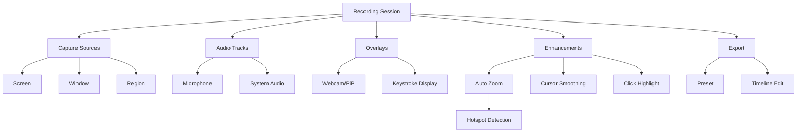

# Smart Screen - 业务术语表

> **层级**: L2 - 业务与领域（What）  
> **角色**: 业务专家 / 架构师  
> **本质**: 问题空间建模

## 核心术语

### Auto Zoom（自动缩放）

基于鼠标活动、点击事件、窗口焦点变化自动放大特定区域，并生成平滑的缩放动画。

**属性**：
- Zoom Level：缩放倍数（1.0x - 3.0x）
- Easing Curve：缓动曲线（ease-in-out、linear）
- Duration：缩放动画持续时间

**触发条件**：
- 鼠标点击事件
- 键盘输入聚焦
- 窗口焦点切换

**示例**：用户点击按钮时，画面自动放大到按钮区域，持续 0.5 秒后恢复

---

### Cursor Smoothing（光标平滑）

对原始鼠标轨迹进行滤波和插值处理，消除抖动，提升视觉观感。

**属性**：
- Smoothing Level：平滑程度（低/中/高）
- Algorithm：滤波算法（Kalman Filter / EWMA / Bezier）

**技术实现**：
- 采集原始光标位置和时间戳
- 应用滤波算法消除高频抖动
- 使用插值生成平滑轨迹

**示例**：快速移动鼠标时，输出视频中的光标轨迹呈现平滑曲线

---

### Click Highlight（点击高亮）

鼠标点击时显示视觉反馈效果，如脉冲动画、圆环扩散等。

**属性**：
- Style：高亮样式（脉冲/圆环/涟漪）
- Color：高亮颜色
- Duration：动画持续时间

**事件类型**：
- 左键单击
- 左键双击
- 右键单击

---

### Hotspot（热点区域）

用户密集交互的区域，通常是鼠标点击或键盘操作的聚集处。

**识别方式**：
- 滑动窗口统计事件密度
- 基于 movement magnitude 计算活跃度

**用途**：
- Auto Zoom 的目标区域
- 智能裁剪的参考点

---

### Preset（预设配置）

导出和录制的配置模板，包含分辨率、帧率、编码参数等。

**属性**：
- Name：预设名称
- Resolution：分辨率（1080p/4K/720p）
- FPS：帧率（30/60）
- Bitrate：码率
- Format：输出格式（MP4/MOV/GIF）
- Aspect Ratio：宽高比（16:9/9:16/1:1）

**内置预设**：
- Web Quality：1080p@30fps，适合网页播放
- High Quality：4K@60fps，适合高清存档
- Social Media：1080p@30fps，适合社媒分享
- Vertical：1080x1920@30fps，适合短视频平台

---

### Recording Session（录制会话）

一次完整的录制过程，从开始录制到停止录制。

**组成部分**：
- Capture Sources：捕获源（屏幕/窗口/区域）
- Audio Tracks：音频轨道（麦克风/系统音频）
- Overlays：叠加层（摄像头/注释/快捷键）
- Enhancements：增强效果（Auto Zoom/Cursor Effects）
- Metadata：元数据（时长/分辨率/时间戳）

---

### Timeline（时间线）

非破坏性编辑界面，用于剪切、调速、插入注释等操作。

**操作类型**：
- Trim：裁剪片段
- Cut：删除片段
- Speed：变速（0.5x - 2x）
- Split：分割片段

**特性**：
- 非破坏性：保留原始素材
- 可撤销：支持无限撤销

---

### PiP (Picture-in-Picture)（画中画）

在主画面上叠加摄像头画面或其他视频源。

**属性**：
- Position：位置（左上/右上/左下/右下/自定义）
- Size：大小（小/中/大/自定义）
- Shape：形状（圆形/圆角矩形/矩形）
- Border：边框样式
- Shadow：阴影效果

---

## 技术术语

### ScreenCaptureKit

Apple 提供的现代屏幕捕获框架（macOS 12.3+），支持高性能、低延迟的屏幕录制。

**优势**：
- 硬件加速
- 低 CPU 占用
- 支持 HDR
- 精细的捕获控制

---

### AVFoundation

Apple 的多媒体框架，用于音视频捕获、处理和导出。

**核心类**：
- `AVCaptureSession`：捕获会话
- `AVAssetWriter`：资源写入
- `AVAssetExportSession`：导出会话

---

### Metal

Apple 的低级图形和计算框架，用于 GPU 加速处理。

**应用场景**：
- 实时视频处理
- Auto Zoom 渲染
- 滤镜和特效

---

### CMSampleBuffer

Core Media 中的采样缓冲区，包含音视频数据和时间戳。

**关键属性**：
- `presentationTimeStamp`：呈现时间戳
- `duration`：持续时间
- `imageBuffer`：图像数据

---

## 术语关系图

## 术语使用规范

1. **统一命名**：团队内部使用标准英文术语，中文文档可附带中文翻译
2. **及时更新**：发现新术语及时补充到本文档
3. **版本管理**：重要术语变更需记录变更历史
4. **代码一致**：代码中的命名应与术语表保持一致

## 相关文档

- [领域模型](./domain-models/domain-model.md)
- [业务流程](./business-processes/workflow.md)
- [业务规则](./business-rules/rules.md)
