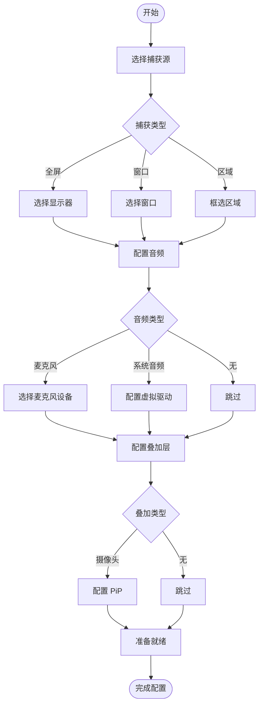
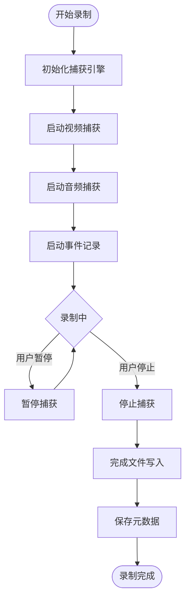
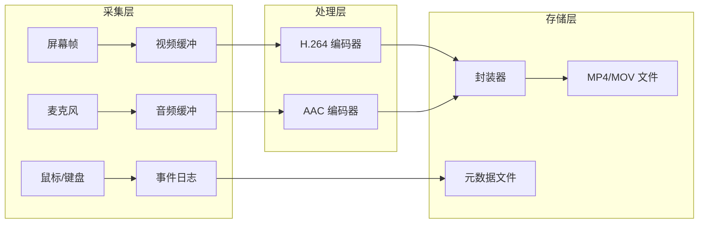
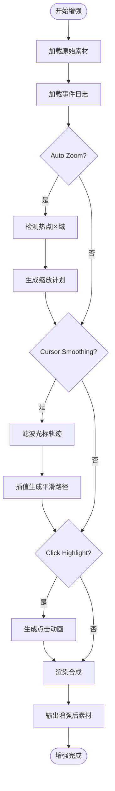
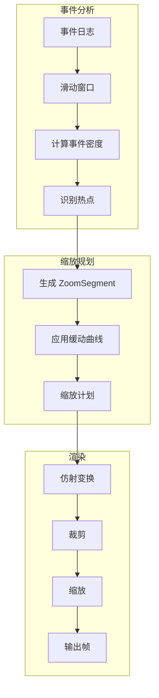
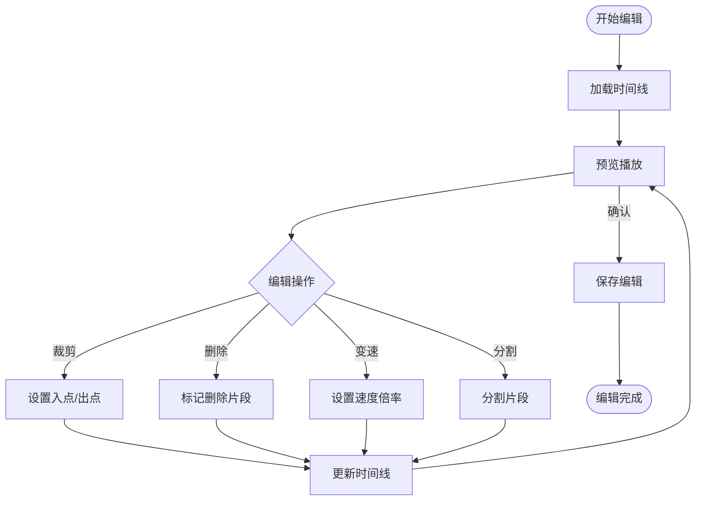
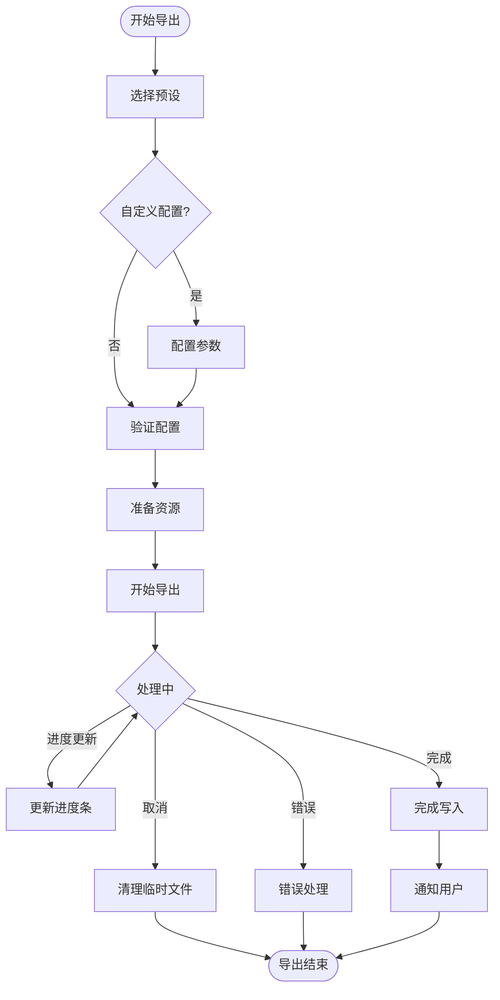
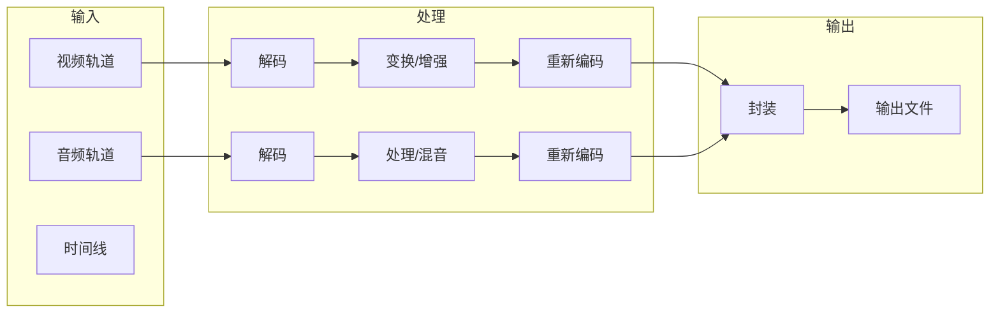
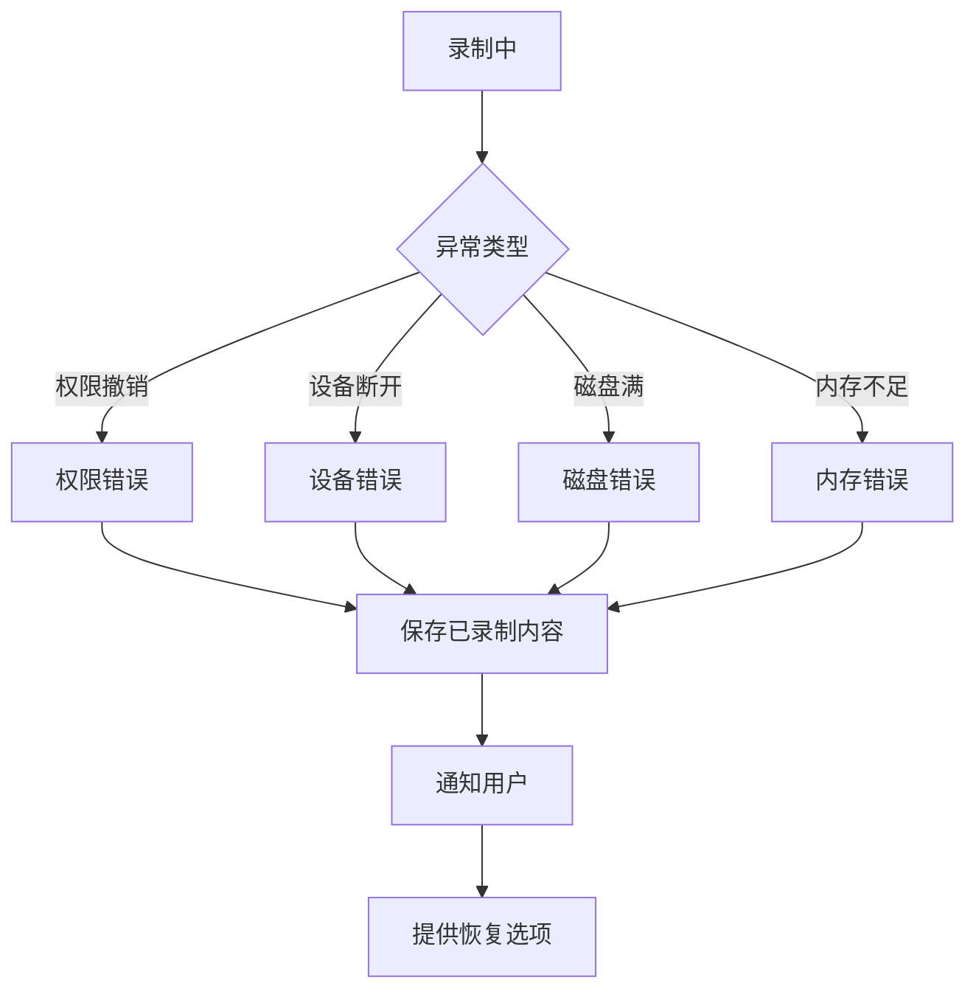

# Smart Screen - 核心业务流程

> **层级**: L2 - 业务与领域（What）  
> **角色**: 业务专家 / 架构师  
> **本质**: 问题空间建模

## 核心流程概览


---

## 流程 1：录制配置流程

### 流程图



### 流程说明

| 阶段 | 活动 | 系统支持 |
|------|------|----------|
| **选择捕获源** | 用户选择录制范围 | 提供全屏/窗口/区域三种模式 |
| **配置音频** | 用户选择音频输入 | 自动检测可用设备，提示系统音频配置 |
| **配置叠加层** | 用户选择是否添加摄像头 | 提供位置、大小、样式配置 |

---

## 流程 2：录制执行流程

### 流程图



### 数据流



### 关键技术点

| 环节 | 技术方案 | 注意事项 |
|------|----------|----------|
| **视频采集** | ScreenCaptureKit / CGDisplayStream | 优先使用 ScreenCaptureKit（macOS 12.3+） |
| **音频采集** | AVCaptureDevice | 系统音频需要 BlackHole 驱动 |
| **编码** | VideoToolbox (H.264/HEVC) | 硬件加速，低 CPU 占用 |
| **封装** | AVAssetWriter | 支持 MP4/MOV |
| **同步** | CMSampleBuffer.presentationTimeStamp | 统一时间基准 |

---

## 流程 3：增强处理流程

### 流程图



### Auto Zoom 算法流程



### Cursor Smoothing 算法

| 算法 | 特点 | 适用场景 |
|------|------|----------|
| **EWMA** | 简单快速，实时性好 | 轻度平滑 |
| **Kalman Filter** | 预测性强，平滑效果好 | 中度平滑 |
| **Bezier 插值** | 曲线平滑，视觉效果佳 | 高度平滑 |

---

## 流程 4：编辑流程

### 流程图



### 非破坏性编辑原理

```
原始素材: [===========================================]
                    ↓ 编辑操作
时间线:   [====] [=======] [====]
          seg1    seg2     seg3
          
seg1: sourceRange(0-5s), speed(1.0x)
seg2: sourceRange(10-20s), speed(1.5x)
seg3: sourceRange(25-30s), speed(1.0x)

导出时按时间线重新组合，原始素材不变
```

---

## 流程 5：导出流程

### 流程图



### 导出管线



---

## 异常处理流程

### 录制异常



### 恢复策略

| 异常类型 | 恢复策略 |
|----------|----------|
| 权限撤销 | 保存已录制内容，提示重新授权 |
| 设备断开 | 保存已录制内容，提示重新连接 |
| 磁盘满 | 保存到临时位置，提示清理空间 |
| 内存不足 | 强制写入磁盘，降低缓冲区大小 |
| 应用崩溃 | 下次启动时检测并恢复临时文件 |

## 相关文档

- [领域模型](../domain-models/domain-model.md)
- [业务规则](../business-rules/rules.md)
