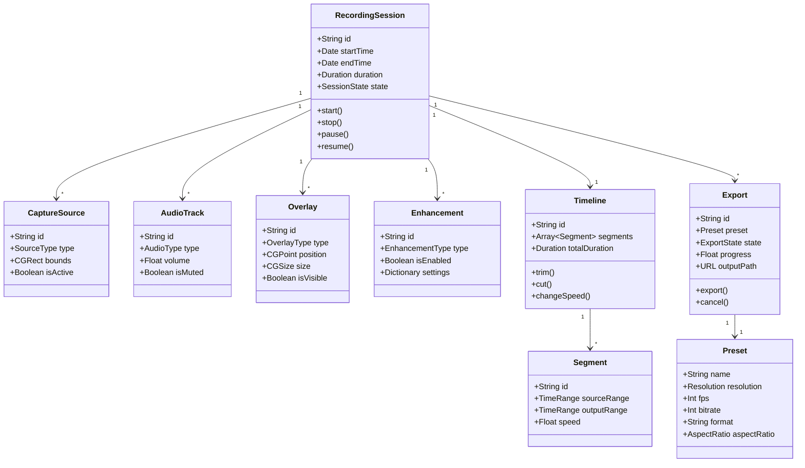
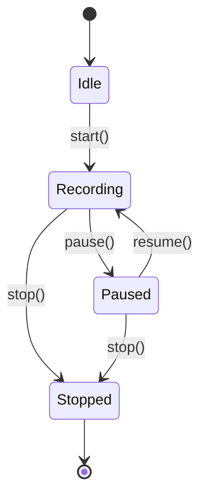
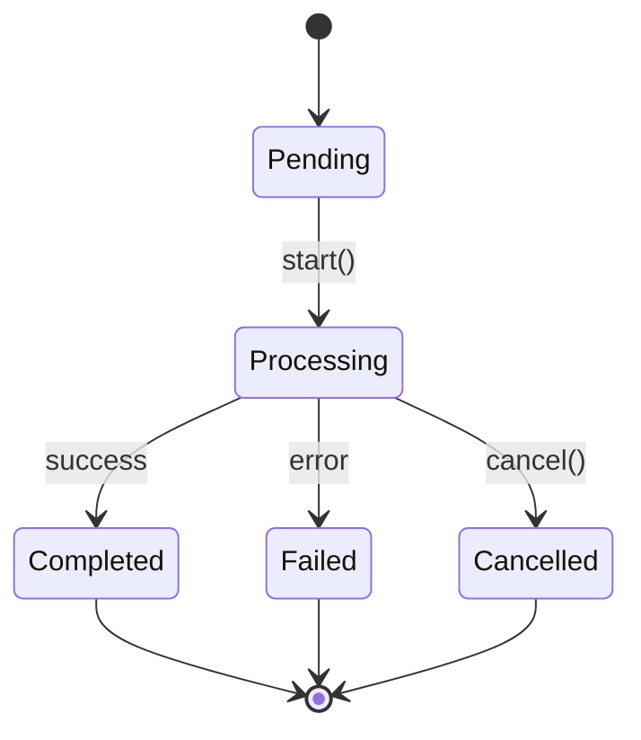
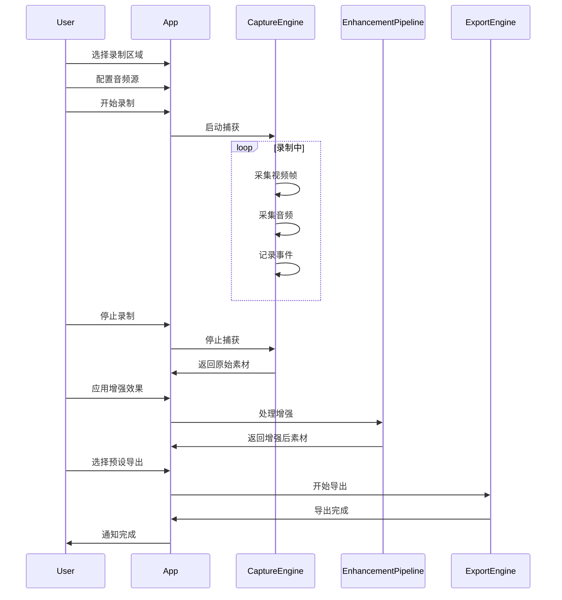

# Smart Screen - 领域模型

> **层级**: L2 - 业务与领域（What）  
> **角色**: 业务专家 / 架构师  
> **本质**: 问题空间建模

## 核心领域模型



## 实体说明

### RecordingSession（录制会话）

核心聚合根，代表一次完整的录制过程。

**属性**：
- `id`: 唯一标识（UUID）
- `startTime`: 开始时间
- `endTime`: 结束时间
- `duration`: 录制时长
- `state`: 会话状态（idle/recording/paused/stopped）

**行为**：
- `start()`: 开始录制
- `stop()`: 停止录制
- `pause()`: 暂停录制
- `resume()`: 恢复录制

**关系**：
- 包含多个 CaptureSource（捕获源）
- 包含多个 AudioTrack（音频轨道）
- 包含多个 Overlay（叠加层）
- 包含多个 Enhancement（增强效果）
- 关联一个 Timeline（时间线）
- 可生成多个 Export（导出任务）

---

### CaptureSource（捕获源）

录制的视频来源。

**属性**：
- `id`: 唯一标识
- `type`: 类型（screen/window/region）
- `bounds`: 捕获区域
- `isActive`: 是否激活

**类型枚举**：
```swift
enum SourceType {
    case fullScreen(displayID: CGDirectDisplayID)
    case window(windowID: CGWindowID)
    case region(rect: CGRect)
}
```

---

### AudioTrack（音频轨道）

音频输入源。

**属性**：
- `id`: 唯一标识
- `type`: 类型（microphone/system）
- `volume`: 音量（0.0-1.0）
- `isMuted`: 是否静音

**注意**：系统音频需要虚拟音频驱动（如 BlackHole）

---

### Enhancement（增强效果）

录制增强功能。

**类型**：
- `autoZoom`: 自动缩放
- `cursorSmoothing`: 光标平滑
- `clickHighlight`: 点击高亮
- `keystrokeDisplay`: 快捷键显示

**配置示例**：
```swift
// Auto Zoom 配置
[
    "zoomLevel": 2.0,
    "duration": 0.5,
    "easing": "easeInOut"
]

// Cursor Smoothing 配置
[
    "level": "medium",
    "algorithm": "kalman"
]
```

---

### Timeline（时间线）

非破坏性编辑模型。

**属性**：
- `id`: 唯一标识
- `segments`: 片段列表
- `totalDuration`: 总时长

**设计原则**：
- 保留原始素材引用
- 片段只存储时间范围和变换参数
- 支持无限撤销/重做

---

### Preset（预设配置）

导出配置模板。

**内置预设**：

| 名称 | 分辨率 | FPS | 格式 | 用途 |
|------|--------|-----|------|------|
| Web | 1920x1080 | 30 | MP4 | 网页播放 |
| High Quality | 3840x2160 | 60 | MOV | 高清存档 |
| Social | 1080x1080 | 30 | MP4 | 社媒分享 |
| Vertical | 1080x1920 | 30 | MP4 | 短视频 |
| GIF | 640x480 | 15 | GIF | 动图 |

---

## 状态机

### RecordingSession 状态



### Export 状态



## 核心流程



## 相关文档

- [业务术语表](../business-glossary.md)
- [业务流程](../business-processes/workflow.md)
- [业务规则](../business-rules/rules.md)
