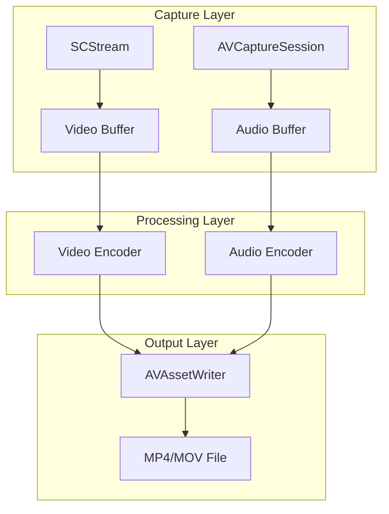

# Recording Engine - 技术设计

> **层级**: L3 - 规格定义（How）  
> **优先级**: P1 - 核心功能  
> **关联**: [功能规格](./functional-spec.md) | [技术栈](../../04-AI-assets/AI-coding/rules/technology-stack.md)

## 技术概述

### 技术栈
- **屏幕捕获**：ScreenCaptureKit
- **音频捕获**：AVFoundation
- **编码**：VideoToolbox (H.264)
- **封装**：AVAssetWriter (MP4/MOV)

### 架构设计
Producer-Consumer 模式：采集线程 → 编码队列 → 磁盘写入线程

## 系统架构



## 核心组件

### ScreenCaptureEngine

**职责**：屏幕内容捕获

```swift
actor ScreenCaptureEngine {
    private var stream: SCStream?
    private var configuration: SCStreamConfiguration
    
    func startCapture(filter: SCContentFilter) async throws {
        stream = SCStream(filter: filter, configuration: configuration, delegate: self)
        try stream?.addStreamOutput(self, type: .screen, sampleHandlerQueue: captureQueue)
        try await stream?.startCapture()
    }
    
    func stopCapture() async {
        try? await stream?.stopCapture()
        stream = nil
    }
}

extension ScreenCaptureEngine: SCStreamOutput {
    nonisolated func stream(_ stream: SCStream, 
                            didOutputSampleBuffer sampleBuffer: CMSampleBuffer, 
                            of type: SCStreamOutputType) {
        Task { await handleVideoFrame(sampleBuffer) }
    }
}
```

### AudioCaptureEngine

**职责**：麦克风音频捕获

```swift
final class AudioCaptureEngine {
    private var captureSession: AVCaptureSession?
    private var audioOutput: AVCaptureAudioDataOutput?
    
    func startCapture(device: AVCaptureDevice) throws {
        let session = AVCaptureSession()
        let input = try AVCaptureDeviceInput(device: device)
        session.addInput(input)
        
        let output = AVCaptureAudioDataOutput()
        output.setSampleBufferDelegate(self, queue: audioQueue)
        session.addOutput(output)
        
        session.startRunning()
        captureSession = session
    }
}
```

### MediaWriter

**职责**：音视频编码和文件写入

```swift
actor MediaWriter {
    private var assetWriter: AVAssetWriter?
    private var videoInput: AVAssetWriterInput?
    private var audioInput: AVAssetWriterInput?
    
    func setup(outputURL: URL, videoSettings: [String: Any], audioSettings: [String: Any]) throws {
        assetWriter = try AVAssetWriter(outputURL: outputURL, fileType: .mp4)
        
        videoInput = AVAssetWriterInput(mediaType: .video, outputSettings: videoSettings)
        videoInput?.expectsMediaDataInRealTime = true
        assetWriter?.add(videoInput!)
        
        audioInput = AVAssetWriterInput(mediaType: .audio, outputSettings: audioSettings)
        audioInput?.expectsMediaDataInRealTime = true
        assetWriter?.add(audioInput!)
    }
    
    func appendVideo(_ sampleBuffer: CMSampleBuffer) {
        guard videoInput?.isReadyForMoreMediaData == true else { return }
        videoInput?.append(sampleBuffer)
    }
    
    func appendAudio(_ sampleBuffer: CMSampleBuffer) {
        guard audioInput?.isReadyForMoreMediaData == true else { return }
        audioInput?.append(sampleBuffer)
    }
}
```

## 数据流设计

### 时间戳同步

```swift
// 使用 CMSampleBuffer 的 presentationTimeStamp 保持 A/V 同步
let presentationTime = CMSampleBufferGetPresentationTimeStamp(sampleBuffer)

// 首帧时间作为基准
if startTime == nil {
    startTime = presentationTime
    assetWriter?.startSession(atSourceTime: presentationTime)
}
```

### 环形缓冲

```swift
// 避免内存线性增长
class RingBuffer<T> {
    private var buffer: [T?]
    private var writeIndex = 0
    private let capacity: Int
    
    func write(_ element: T) {
        buffer[writeIndex % capacity] = element
        writeIndex += 1
    }
}
```

## 编码配置

### 视频编码设置

```swift
let videoSettings: [String: Any] = [
    AVVideoCodecKey: AVVideoCodecType.h264,
    AVVideoWidthKey: 1920,
    AVVideoHeightKey: 1080,
    AVVideoCompressionPropertiesKey: [
        AVVideoAverageBitRateKey: 8_000_000,
        AVVideoProfileLevelKey: AVVideoProfileLevelH264HighAutoLevel,
        AVVideoH264EntropyModeKey: AVVideoH264EntropyModeCABAC
    ]
]
```

### 音频编码设置

```swift
let audioSettings: [String: Any] = [
    AVFormatIDKey: kAudioFormatMPEG4AAC,
    AVSampleRateKey: 44100,
    AVNumberOfChannelsKey: 2,
    AVEncoderBitRateKey: 128000
]
```

## 错误处理

### 错误类型

```swift
enum RecordingError: LocalizedError {
    case permissionDenied
    case captureSessionFailed(underlying: Error)
    case encodingFailed(reason: String)
    case diskFull
    case deviceUnavailable(deviceType: String)
    
    var errorDescription: String? {
        switch self {
        case .permissionDenied:
            return "Screen recording permission is required"
        case .captureSessionFailed(let error):
            return "Capture failed: \(error.localizedDescription)"
        case .encodingFailed(let reason):
            return "Encoding failed: \(reason)"
        case .diskFull:
            return "Disk is full"
        case .deviceUnavailable(let type):
            return "\(type) device is unavailable"
        }
    }
}
```

### 恢复策略

| 错误 | 处理 |
|------|------|
| 权限撤销 | 保存已录制内容，提示用户 |
| 设备断开 | 优雅降级，继续录制（无音频） |
| 磁盘满 | 自动停止，保存已有内容 |
| 编码失败 | 重试 3 次后降级编码参数 |

## 性能优化

### 内存管理

```swift
// 使用 autoreleasepool 处理大量帧
for frame in frameBuffer {
    autoreleasepool {
        processFrame(frame)
    }
}
```

### 线程模型

```swift
// 专用队列
let captureQueue = DispatchQueue(label: "capture", qos: .userInteractive)
let encodingQueue = DispatchQueue(label: "encoding", qos: .userInitiated)
let writerQueue = DispatchQueue(label: "writer", qos: .utility)
```

## 测试策略

### 单元测试

```swift
func test_should_start_capture_when_permission_granted() async throws {
    // given
    let mockStream = MockSCStream()
    let sut = ScreenCaptureEngine(streamFactory: { mockStream })
    
    // when
    try await sut.startCapture(filter: testFilter)
    
    // then
    XCTAssertTrue(mockStream.isCapturing)
}
```

### 集成测试

- 真实设备捕获测试
- 长时录制稳定性测试
- 高 CPU 负载场景测试

## 相关文档

- [功能规格](./functional-spec.md)
- [UI 规格](./ui-spec.md)
- [架构规范](../../04-AI-assets/AI-coding/rules/swift-architecture.md)
