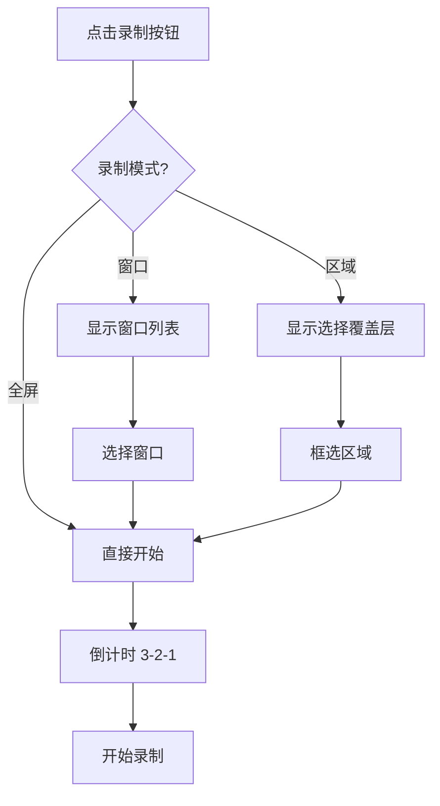

# Recording Engine - UI 规格

> **层级**: L3 - 规格定义（How）  
> **优先级**: P1 - 核心功能  
> **关联**: [功能规格](./functional-spec.md)

## 设计概述

### 设计目标
- 极简操作：一键开始录制
- 状态清晰：随时了解录制状态
- 非侵入式：录制时不干扰用户操作

### 用户画像参考
- **主要用户**：教学者、产品演示者
- **使用场景**：制作教程、产品演示

## 页面结构

### 控制面板（主界面）

```
┌─────────────────────────────────────────┐
│  Smart Screen                     [—][×]│
├─────────────────────────────────────────┤
│                                         │
│   ┌─────────────────────────────────┐   │
│   │     [🎬] 点击开始录制           │   │
│   │                                 │   │
│   │   录制模式: [全屏 ▼]            │   │
│   │   音频源:   [MacBook 麦克风 ▼]  │   │
│   └─────────────────────────────────┘   │
│                                         │
│   ┌──────────────────┐                  │
│   │ ⌘⇧R 快捷键录制   │                  │
│   └──────────────────┘                  │
│                                         │
└─────────────────────────────────────────┘
```

### 录制中状态

```
┌─────────────────────────────────────────┐
│  ● 录制中                         [—][×]│
├─────────────────────────────────────────┤
│                                         │
│   ┌─────────────────────────────────┐   │
│   │     ● 00:05:32                  │   │
│   │                                 │   │
│   │   [⏸️ 暂停]    [⏹️ 停止]        │   │
│   └─────────────────────────────────┘   │
│                                         │
│   🎤 ████████░░░░ 麦克风正常            │
│                                         │
└─────────────────────────────────────────┘
```

### 区域选择覆盖层

```
┌─────────────────────────────────────────────────────┐
│                                                     │
│       ┌─────────────────────────────┐               │
│       │ ○                         ○ │               │
│       │                             │               │
│       │     选择录制区域            │               │
│       │     1920 × 1080             │               │
│       │                             │               │
│       │ ○                         ○ │               │
│       └─────────────────────────────┘               │
│                                                     │
│   [取消]                    [开始录制]              │
└─────────────────────────────────────────────────────┘
```

## 组件规格

### 录制按钮

**状态**：
- **默认**：红色圆形，带录制图标
- **悬停**：轻微放大，加深颜色
- **录制中**：脉冲动画，显示时长
- **暂停**：闪烁效果

**尺寸**：64 × 64 pt

**样式**：
```swift
.frame(width: 64, height: 64)
.background(isRecording ? Color.red : Color.red.opacity(0.8))
.clipShape(Circle())
.shadow(color: .red.opacity(0.3), radius: 10)
```

### 模式选择器

**选项**：
- 全屏
- 窗口
- 区域

**交互**：
- 点击展开下拉菜单
- 选择后立即生效
- 窗口模式显示窗口缩略图列表

### 音频指示器

**显示内容**：
- 设备名称
- 实时音量条
- 静音状态

**样式**：
- 音量条：绿色渐变
- 静音时：灰色 + 删除线

### 时长显示

**格式**：`HH:MM:SS`

**样式**：
- 字体：SF Mono, 24pt
- 颜色：录制中红色，暂停时闪烁

## 交互设计

### 开始录制流程



### 快捷键

| 快捷键 | 功能 |
|--------|------|
| `⌘⇧R` | 开始/停止录制 |
| `⌘⇧P` | 暂停/恢复 |
| `Esc` | 取消区域选择 |

### 反馈方式

| 事件 | 反馈 |
|------|------|
| 开始录制 | 声音提示 + 菜单栏图标变红 |
| 停止录制 | 通知 + 打开文件位置 |
| 错误 | Alert 弹窗 |

## 响应式设计

### 窗口尺寸

- **最小**：300 × 200
- **默认**：400 × 300
- **可调整**：支持拖拽调整

### 暗色模式

- 自动适配系统设置
- 使用 `.background(.ultraThinMaterial)` 毛玻璃效果

## 无障碍设计

- 所有按钮支持 VoiceOver
- 快捷键支持自定义
- 高对比度模式兼容

## 验收标准

### UI 验收
- [ ] 布局符合设计稿
- [ ] 响应式适配完成
- [ ] 暗色模式正常
- [ ] 动画流畅（60fps）

## 相关文档

- [功能规格](./functional-spec.md)
- [技术设计](./technical-spec.md)
