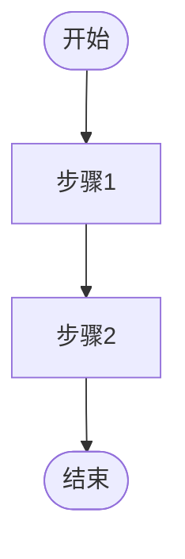

# [功能名称] - 功能规格说明

> **层级**: L3 - 规格定义（How）  
> **角色**: 工程团队  
> **本质**: 可实现的解空间  
> **关联**: [引用 L1/L2 文档]

## 功能概述

### 功能描述
[简要描述功能的核心价值和目标]

### 业务背景
- **业务需求来源**：[引用 L1 产品愿景或 L2 业务规则]
- **解决的核心问题**：[问题描述]
- **预期效果**：[预期达成的效果]

## 功能范围

### 包含范围
- ✅ 功能点 1
- ✅ 功能点 2
- ✅ 功能点 3

### 不包含范围（后续迭代）
- ⏳ 功能点 1
- ⏳ 功能点 2

## 用户故事

### 故事 1：[故事标题]
**作为** [角色]  
**我希望** [目标]  
**以便** [价值]

**验收标准**：
- [ ] 标准 1
- [ ] 标准 2
- [ ] 标准 3

## 功能流程

### 主流程



### 异常流程
- **异常 1**：[描述] → [处理方式]
- **异常 2**：[描述] → [处理方式]

## 数据模型

### 核心实体
- **Entity1**：[描述]
- **Entity2**：[描述]

### 数据关系
[描述实体间的关系]

## 业务规则

### 规则 1：[规则名称]
- **规则描述**：[引用 L2 业务规则]
- **实现方式**：[技术实现说明]

## 接口定义

### API 1：[接口名称]
- **路径**：`/api/v1/xxx`
- **方法**：GET/POST/PUT/DELETE
- **请求参数**：
  - `param1` (string, required): 参数说明
  - `param2` (number, optional): 参数说明
- **响应格式**：
```json
{
  "code": 200,
  "data": {},
  "message": "success"
}
```

## 验收标准

### 功能验收
- [ ] 验收项 1
- [ ] 验收项 2
- [ ] 验收项 3

### 性能要求
- **响应时间**：< 500ms
- **并发支持**：1000 QPS
- **可用性**：99.9%

### 安全要求
- [ ] 安全要求 1
- [ ] 安全要求 2

## 测试用例

### 用例 1：[用例名称]
- **前置条件**：条件描述
- **测试步骤**：
  1. 步骤 1
  2. 步骤 2
- **预期结果**：结果描述

## 相关文档

- [UI 规格说明](../ui-spec.md)
- [技术设计文档](../technical-design-spec.md)
- [业务规则](../../02-business-and-domain/business-rules/rules.md)
