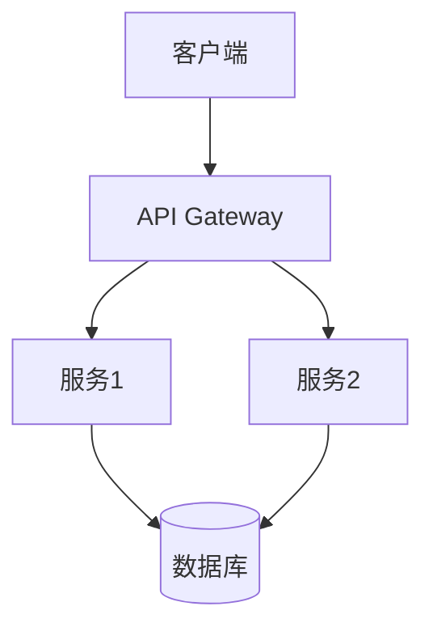
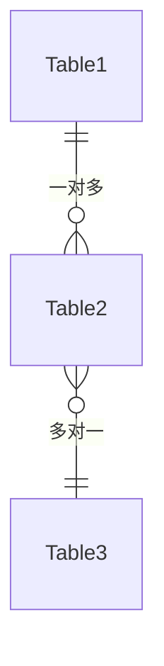

# [功能名称] - 技术设计文档

> **层级**: L3 - 规格定义（How）  
> **角色**: 工程团队  
> **本质**: 可实现的解空间  
> **关联**: [引用功能规格文档]

## 技术概述

### 技术栈
- **前端**：[技术栈]
- **后端**：[技术栈]
- **数据库**：[数据库类型]
- **基础设施**：[云服务/部署方式]

### 架构设计
[描述整体架构设计]

## 系统架构

### 架构图



### 模块划分
- **模块1**：[职责说明]
- **模块2**：[职责说明]
- **模块3**：[职责说明]

## 数据库设计

### 数据表设计

#### 表 1：table_name
| 字段名 | 类型 | 约束 | 说明 |
|--------|------|------|------|
| `id` | bigint | PK, AUTO_INCREMENT | 主键 |
| `name` | varchar(255) | NOT NULL | 名称 |
| `created_at` | datetime | NOT NULL | 创建时间 |

### 索引设计
- **主键索引**：`id`
- **唯一索引**：`name`
- **普通索引**：`created_at`

### 数据关系


## API 设计

### API 列表
| API | 方法 | 路径 | 说明 |
|-----|------|------|------|
| 获取列表 | GET | `/api/v1/items` | 获取列表 |
| 创建 | POST | `/api/v1/items` | 创建新项 |
| 更新 | PUT | `/api/v1/items/:id` | 更新项 |
| 删除 | DELETE | `/api/v1/items/:id` | 删除项 |

### API 详细设计

#### GET /api/v1/items
**请求参数**：
```json
{
  "page": 1,
  "pageSize": 20,
  "filter": {}
}
```

**响应格式**：
```json
{
  "code": 200,
  "data": {
    "items": [],
    "total": 100,
    "page": 1,
    "pageSize": 20
  },
  "message": "success"
}
```

**错误码**：
- `400`: 请求参数错误
- `401`: 未授权
- `500`: 服务器错误

## 前端设计

### 组件结构
```
src/
├── components/
│   ├── Component1/
│   │   ├── index.tsx
│   │   ├── Component1.tsx
│   │   └── Component1.module.css
│   └── Component2/
├── pages/
│   └── Page1/
├── hooks/
│   └── useHook1.ts
└── utils/
    └── util1.ts
```

### 状态管理
- **全局状态**：[使用 Redux/Zustand/Context]
- **本地状态**：[使用 useState/useReducer]

### 路由设计
| 路径 | 组件 | 权限要求 |
|------|------|----------|
| `/` | HomePage | 公开 |
| `/dashboard` | DashboardPage | 需要登录 |
| `/admin` | AdminPage | 需要管理员权限 |

## 后端设计

### 服务架构
- **Controller 层**：处理 HTTP 请求
- **Service 层**：业务逻辑处理
- **Repository 层**：数据访问

### 核心类设计

#### Class1
```typescript
class Class1 {
  // 属性
  private prop1: string;
  
  // 方法
  public method1(): void {
    // 实现
  }
}
```

## 安全设计

### 认证授权
- **认证方式**：[JWT/OAuth2/其他]
- **权限控制**：[RBAC/ABAC]
- **会话管理**：[描述]

### 数据安全
- **数据加密**：[加密方式]
- **敏感数据处理**：[处理方式]
- **SQL 注入防护**：[防护措施]

## 性能优化

### 前端优化
- **代码分割**：按路由分割
- **懒加载**：组件懒加载
- **缓存策略**：[缓存方案]

### 后端优化
- **数据库优化**：索引优化、查询优化
- **缓存策略**：[Redis/其他]
- **CDN**：[CDN 配置]

## 监控与日志

### 监控指标
- **性能指标**：响应时间、吞吐量
- **错误指标**：错误率、错误类型
- **业务指标**：[业务相关指标]

### 日志设计
- **日志级别**：DEBUG/INFO/WARN/ERROR
- **日志格式**：[格式说明]
- **日志存储**：[存储方式]

## 测试策略

### 单元测试
- **覆盖率目标**：> 80%
- **测试框架**：[Jest/Vitest/其他]

### 集成测试
- **测试范围**：[范围说明]
- **测试工具**：[工具说明]

### E2E 测试
- **测试场景**：[场景列表]
- **测试工具**：[Cypress/Playwright/其他]

## 部署方案

### 部署环境
- **开发环境**：[环境配置]
- **测试环境**：[环境配置]
- **生产环境**：[环境配置]

### 部署流程
1. 代码提交
2. 自动构建
3. 自动化测试
4. 部署到测试环境
5. 验收测试
6. 部署到生产环境

## 风险评估

### 技术风险
| 风险 | 影响 | 概率 | 应对措施 |
|------|------|------|----------|
| 性能瓶颈 | 高 | 中 | [措施] |
| 第三方依赖 | 中 | 低 | [措施] |

## 相关文档

- [功能规格说明](../functional-spec.md)
- [UI 规格说明](../ui-spec.md)
- [架构文档](../../04-AI-assets/AI-coding/rules/)
