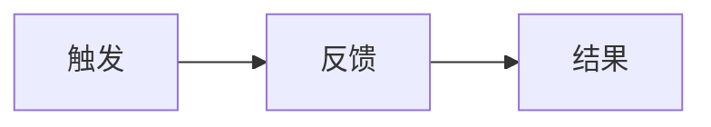

# [功能名称] - UI 规格说明

> **层级**: L3 - 规格定义（How）  
> **角色**: 工程团队 / UI/UX 设计师  
> **本质**: 可实现的解空间  
> **关联**: [引用功能规格文档]

## 设计概述

### 设计目标
[描述 UI 设计的目标和原则]

### 用户画像参考
- **主要用户**：[引用 L1 用户画像]
- **使用场景**：[场景描述]

## 页面结构

### 页面层级
```
页面1
├── 区域1
│   ├── 组件1
│   └── 组件2
└── 区域2
    └── 组件3
```

## 页面布局

### 页面 1：[页面名称]

#### 布局说明
- **布局类型**：单栏/双栏/三栏
- **响应式断点**：
  - Mobile: < 768px
  - Tablet: 768px - 1024px
  - Desktop: > 1024px

#### 组件清单
| 组件 | 位置 | 说明 |
|------|------|------|
| Header | 顶部 | 页面头部 |
| Sidebar | 左侧 | 侧边栏 |
| Content | 中间 | 主要内容区 |

## 交互设计

### 交互 1：[交互名称]

#### 触发条件
- 用户操作：[操作描述]
- 系统事件：[事件描述]

#### 交互流程


#### 交互细节
- **动画效果**：[描述]
- **反馈方式**：[提示/加载/错误提示]
- **响应时间**：< 300ms

## 组件规格

### 组件 1：[组件名称]

#### 组件描述
[组件功能说明]

#### 属性定义
| 属性名 | 类型 | 必填 | 默认值 | 说明 |
|--------|------|------|--------|------|
| `prop1` | string | 是 | - | 属性说明 |
| `prop2` | number | 否 | 0 | 属性说明 |

#### 状态定义
- **默认状态**：[描述]
- **悬停状态**：[描述]
- **激活状态**：[描述]
- **禁用状态**：[描述]
- **错误状态**：[描述]

#### 样式规范
- **尺寸**：宽度 x 高度
- **颜色**：主色 #xxxxxx
- **字体**：字号/字重/行高
- **间距**：内边距/外边距

## 响应式设计

### 断点 1：Mobile (< 768px)
- **布局调整**：[描述]
- **组件变化**：[描述]
- **交互优化**：[描述]

### 断点 2：Tablet (768px - 1024px)
- **布局调整**：[描述]
- **组件变化**：[描述]

### 断点 3：Desktop (> 1024px)
- **布局调整**：[描述]
- **组件变化**：[描述]

## 无障碍设计

### 可访问性要求
- **键盘导航**：支持 Tab 键导航
- **屏幕阅读器**：提供 ARIA 标签
- **颜色对比度**：符合 WCAG AA 标准
- **焦点指示**：清晰的焦点状态

## 设计资源

### 设计稿
- **Figma 链接**：[链接]
- **设计稿版本**：v1.0

### 设计规范
- **设计系统**：[引用设计系统文档]
- **组件库**：[引用组件库文档]

## 验收标准

### UI 验收
- [ ] 视觉还原度 > 95%
- [ ] 响应式适配完成
- [ ] 交互流畅度达标
- [ ] 无障碍功能完整

## 相关文档

- [功能规格说明](../functional-spec.md)
- [技术设计文档](../technical-design-spec.md)
